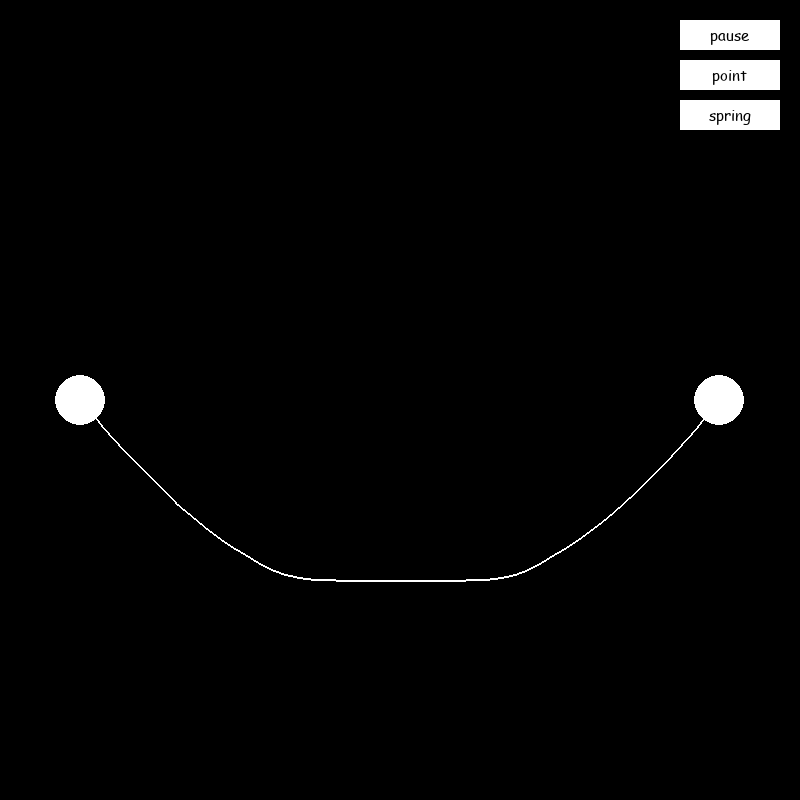

# Spring–Mass Simulator

A Pygame sandbox for point masses, damped springs and flexible strings.



## What it contains

- Custom 2D vectors, point masses and spring joints.
- A flexible string suspended between two heavy endpoints.
- Additional scene configurations are preserved in main.py.

## Setup

Use Python 3.12. From the repository folder:

```bash
python -m venv .venv
# Windows PowerShell: .venv\Scripts\Activate.ps1
# macOS / Linux: source .venv/bin/activate
python -m pip install -r requirements.txt
python main.py
```

## Controls

Run the preset simulation and close the window to exit. Edit the scene in main.py to experiment.

## Project status

The pause, point and spring buttons are UI placeholders: their callbacks currently print a message. The numerical model is experimental.

## Project collection

Part of [lnivan's projects](https://github.com/lnivan), under **Simulations**.
