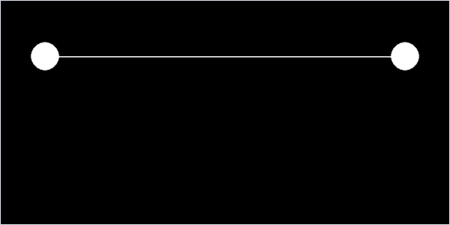

<div align="center">

# Spring-Mass Simulator

*A string of 51 point masses on springs sags and swings between two heavy anchors, stepped with semi-implicit Euler.*




</div>

## About

A small mass-spring engine written from scratch, with its own 2D vector class, point masses and damped spring joints. Pygame only opens the window and draws. The preset scene stretches a 600 px string of 51 light masses between two very heavy end masses. It starts straight and unstretched, then falls under gravity and swings, slowly settling into a sag. `main.py` also keeps five other scenes as commented-out blocks: a square of springs, a chain, a ten-mass braced truss, a single spring and a second string. Three buttons in the corner are placeholders for an editor that was never finished.

## Quick start

```bash
python -m pip install -r requirements.txt
python main.py
```

## Controls

| Input | Action |
| --- | --- |
| Hover a button | Turns it grey |
| Click **pause**, **point** or **spring** | Prints `hola` ("hello") to the console; nothing else yet |
| Close the window | Quit |

## How it works

- **Units.** Positions are in pixels with y pointing up, and time is in seconds. The window is 800 × 800, and the drawing code flips y.
- **Hooke's law.** Each spring joint compares the distance between its two masses with its rest length $L$ and pushes them equally and oppositely along $\mathbf d = \mathbf r_2 - \mathbf r_1$:

  ```math
  \mathbf F_1 = k\bigl(\lVert\mathbf d\rVert - L\bigr)\,\hat{\mathbf d},\qquad \mathbf F_2 = -\mathbf F_1
  ```

  A damping term along $\hat{\mathbf d}$ is added as well. It is meant to be proportional to the relative velocity along the spring, but a bug in the dot product changes it (see Limitations).
- **Semi-implicit Euler.** All spring forces are summed first. Then every mass adds its own gravity $-mg\hat{\mathbf y}$ and takes one step, updating velocity before position, with a fixed $\Delta t = 0.0005$ s per frame:

  ```math
  \mathbf v \leftarrow \mathbf v + \frac{\mathbf F}{m}\,\Delta t,\qquad \mathbf r \leftarrow \mathbf r + \mathbf v\,\Delta t
  ```

- **Strings.** `System.AddString` places $N + 1$ equally spaced masses between two points and joins neighbours with springs whose rest length is the spacing, so the string starts unstretched. The scene uses $N = 50$ (12 px spacing), $m = 0.1$, $k = 2000$, damping 20 and $g = 1000$ px/s².
- **Anchors.** The two end masses are not pinned. They are free masses of $10^7$ with no gravity, joined to the string by 20 px springs with $k = 3000$. In a 20-second headless run they moved by only about 0.05 px.
- **Drawing.** Each mass is a circle whose radius comes from a sphere of density 0.1, $r = \bigl(3m / (4\pi \cdot 0.1)\bigr)^{1/3}$, capped at 25 px. The anchors hit the cap, while the string's masses come out at about 0.6 px and do not show. A spring is drawn as a zigzag with $\lfloor L/7 \rfloor$ segments that alternate 4 px either side of its axis, so the string's 12 px springs come out as straight lines.

## Code map

| Path | Role |
| --- | --- |
| `main.py` | Builds the scene and the three buttons, and runs the loop; keeps the alternative scenes as comments |
| `physics.py` | `MassPoint`, `SpringJoint` and `System`, which owns the masses and springs and steps them |
| `vector2.py` | `Vector2`: addition, scaling, length (`mod`), unit vector, normal and a broken dot product |
| `draw.py` | `Window`: clears the screen and draws masses, zigzag springs and buttons |
| `UI.py` | `Button`: hover detection and a click callback |

## Limitations

- `Vector2.__mul__` computes the dot product as $x_1x_2 + y_1 + y_2$ instead of $x_1x_2 + y_1y_2$. Only the damper uses it, so damping goes wrong as soon as a spring tilts or its two ends move at different vertical speeds. In a headless test the string rose above its starting line during the first two seconds, which did not happen with a corrected dot product.
- There is no clock: every frame advances the simulation by 0.0005 s, so the speed on screen depends on the machine.
- The buttons only print `hola`, and the masses cannot be touched with the mouse. Changing the scene means editing `main.py`.
- A spring with a rest length under 7 px crashes the drawing code with a division by zero, because its zigzag has no segments.
- `System.GetEnergy` is unfinished: it never returns a value, and its spring term is not a spring energy. Nothing calls it.

---

<div align="center"><sub>Part of <a href="https://github.com/lnivan">lnivan's projects</a> · <b>Simulations</b></sub></div>
